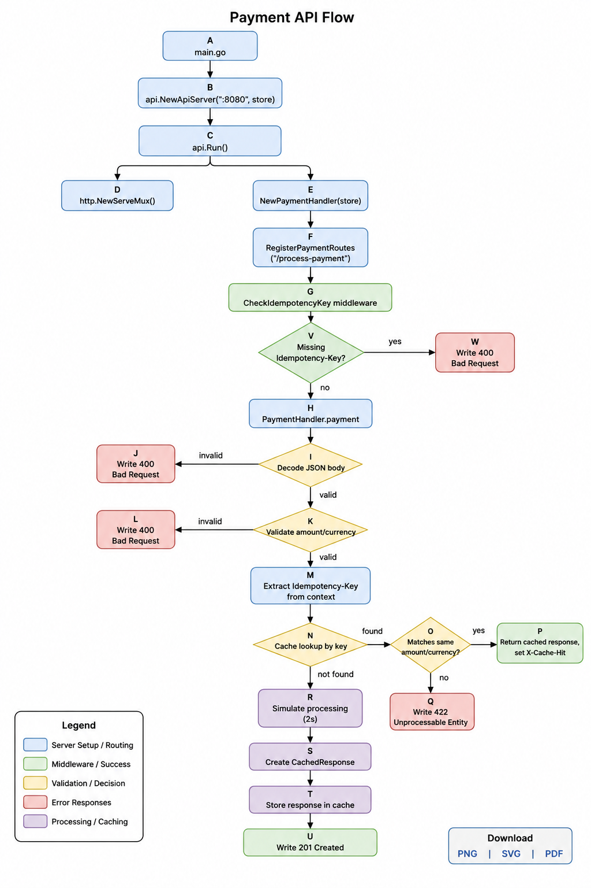

# Idempotency-Gateway Diagrams, Instructions and Documentation

## 1. Architecture Diagram



### 2. Setup Instructions

### Prerequisites

- Go 1.26.2 or later installed
- Git installed

### Clone the repository

```bash
git clone https://github.com/amalitechglobaltraining/Idempotency-Gateway.git
cd Idempotency-Gateway
```

### Since there are no external libraries, ```go mod tidy``` is not needed

### Run locally

```bash
go run main.go
```

The server will start on `http://localhost:8080`.

### Test the API

Send a request with a unique `Idempotency-Key` header.

```bash
curl -X POST http://localhost:8080/process-payment \
  -H "Content-Type: application/json" \
  -H "Idempotency-Key: test-key-123" \
  -d '{"amount":100,"currency":"GHS"}'
```

### Expected behavior

- Requests must include the `Idempotency-Key` header.
- Endpoint: `POST /process-payment`
- First request with a new key processes the payment and stores the response.
- Repeated requests with the same key and identical body return the cached response.
- Repeated requests with the same key but different body return a `422 Unprocessable Entity` error.

### Notes

- This project uses an in-memory map for idempotency storage, so stored responses are lost when the server restarts.
- The API simulates processing with a 2-second delay on the first request.

## 3. API Documentation

### Base URL

`http://localhost:8080`

### Endpoints

#### `POST /process-payment`

Processes a payment request using an idempotency key.

#### Request Headers

- `Content-Type: application/json`
- `Idempotency-Key: <unique-string>`

#### Request Body

```json
{
  "amount": 100,
  "currency": "GHS"
}
```

#### Success Response

- Status: `201 Created`
- Body: `Charged 550 GHS`

#### Cached Response (Idempotent replay)

If the same `Idempotency-Key` is used again with the same request body:

- Status: same as the original response
- Header: `X-Cache-Hit: true`
- Body: same cached response string

#### Error Responses

##### Missing `Idempotency-Key`

- Status: `400 Bad Request`
- Body: JSON error with message `missing idempotency key`

##### Invalid JSON body

- Status: `400 Bad Request`
- Body: JSON error with the decoder error message

##### Missing required fields

- Status: `400 Bad Request`
- Body: JSON error with message `missing amount or currency`

##### Same key, different request body

- Status: `422 Unprocessable Entity`
- Body: JSON error with message `idempotency key already used for a different request body`

### Example request

```bash
curl -X POST http://localhost:8080/process-payment \
  -H "Content-Type: application/json" \
  -H "Idempotency-Key: some-key-911" \
  -d '{"amount":220,"currency":"USD"}'
```

### Behavior Notes

- The project stores responses in-memory, so cached behavior resets when the server restarts.
- The first submission with a new `Idempotency-Key` includes a simulated processing delay.
- Replays with a matching `Idempotency-Key` and identical payload return the previously stored response.
- Replays with the same key but a different payload return an error.

## 4. Design Decisions

### In-Memory Idempotency Store

- Used a Go `map[string]types.CachedResponse` as the idempotency cache for simplicity.
- This was because this is a demo project and keeps the project lightweight.
- Note: the cache is not persistent, so the stored responses are lost when the server restarts.

### Middleware for Idempotency Key Validation

- Implemented `middleware.CheckIdempotencyKey` to enforce the presence of `Idempotency-Key` in the request header.
- The middleware stores the header value in the request context for downstream handlers.
- This separates validation from payment logic and keeps route handlers focused on core behavior.

### Single Endpoint Design

- The API exposes a single endpoint: `POST /process-payment`.
- This keeps the interface minimal and aligned with the core idempotent payment flow.

### Payload Validation

- The payment handler validates required fields in the JSON body (`amount` and `currency`).
- Invalid JSON or missing fields produce `400 Bad Request` errors.
- This ensures only valid payment requests reach the idempotency logic.

### Idempotency Logic

- If a request arrives with an existing key and identical payload, then the cached response is returned.
- If the payload differs, the service returns `422 Unprocessable Entity` to indicate key reuse conflict.
- This enforces the core idempotent contract: same key, same operation only.

### Mutex Protection

- The payment handler uses a `sync.Mutex` around cache access and update.
- This avoids race conditions when concurrent requests use the same idempotency key.

### Simulated Processing Delay

- A 2-second delay is intentionally included on the first request to simulate payment processing.
- This makes idempotency behavior easier to observe in replay scenarios.

### Simple API Documentation Separation

- Created `API.md` for endpoint details and request/response examples.
- Created `SETUP.md` for repository setup instructions.
- Created `design.md` for design rationale and architecture choices.

## 5. The Developers Choice

- Go will always thrive to be concurrent hence when two or more requests arrive
at the same time, a goroutine will be spawned to handle that request concurrently and
if the server or machine has multiple cores, it will be run in parallel.
- However, this feature could pose a problem due to the use of the map data structure
in golang. The map data structure returns data in an unordered way and due to multiple
go routines trying to access and modify the same structure, we could be dealing with race
conditions and hence incorrect and inconsistent data.
- This was why mutexes were used to ensure that only one goroutine can access the data
structure once at a time.
- This also achieved the "blocking" effect of a request when two or more arrive at relatively the same time.
- For my developer's choice I have implemented a logging feature to log all successful
requests
